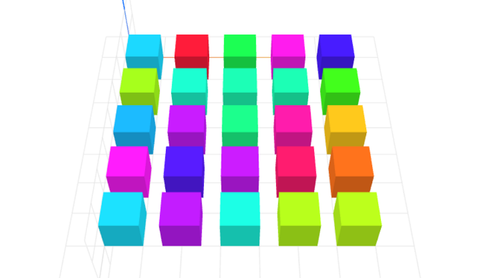

# grid-layout
Grid layout for CraftML by doubleshow

### Usage
```html
<craft>
    <craft name="grid-layout" module="grid-layout"/>
    <grid-layout></grid-layout>
</craft>
```

### Parameters
- rows: adjusts number of rows in grid
    - default: 5
- cols: adjusts number of columns in grid
    - default: 5
- rowSpacing: adjusts spacing of objects in row
    - default: 5
- colSpacing: adjusts spacing of objects in column
    - default: 5

### Example
```html
<craft>
    <craft name="grid-layout" module="grid-layout"/>
    <grid-layout>
        <cube></cube>
    </grid-layout>
</craft>
```

